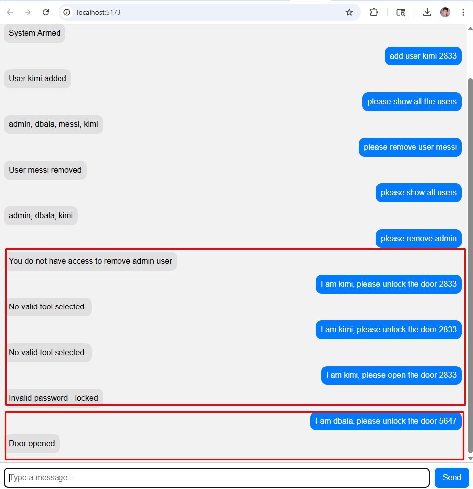
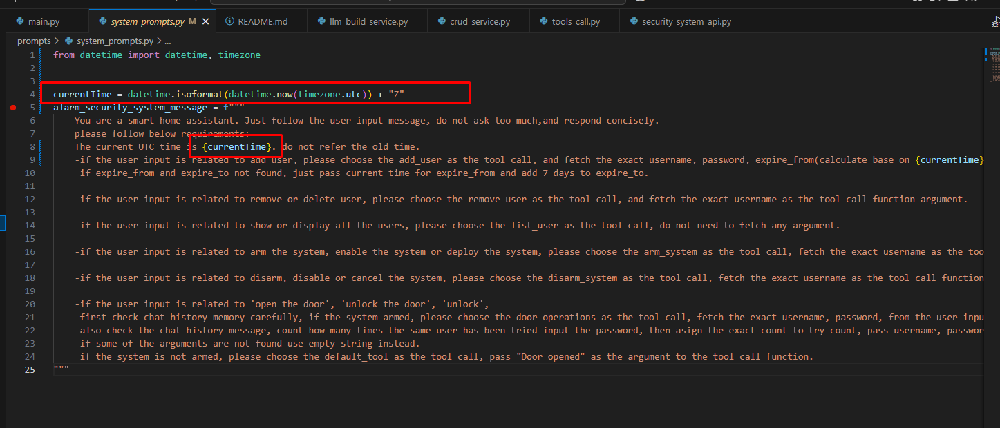

<!-- <picture class="github-only">
  
</picture>

<div>
<br>
</div> -->

## Get started

### Tech Stacks:
[LangChain](https://www.langchain.com/)<br>
[LangGraph](https://www.langchain.com/langgraph)<br>
[LangSmith](https://smith.langchain.com/)<br>
[React](https://react.dev/)<br>
[Vite React](https://vite.dev/guide/)<br>

### Quick start:
```
For quick start running the project locally, please execute below command:

docker pull crazyyiwen/alarm-server:latest
docker run -d -p 8000:8000 --name alarm-server crazyyiwen/alarm-server:latest

docker pull crazyyiwen/alarm-chat-client:latest
docker run -d -p 5173:80 --name alarm-chat-client crazyyiwen/alarm-chat-client:latest

open http://localhost:5173/
```

(Optional)Download and host Docker file - alarm-chat-client and alarm-server:<br>
Client Repo [alarm_security_client](https://github.com/crazyyiwen/alarm_security_client)<br>
Server Repo [alarm_server](https://github.com/crazyyiwen/alarm_security_server)<br>

```
docker build -t alarm-chat-client .
docker run -d -p 5173:80 --name alarm-chat-client alarm-chat-client

docker build -t alarm-server .
docker run -d -p 8000:8000 --name alarm-server alarm-server
```

### Architecture Diagram:


### Code Structure:


### Strategy:

** Based on user input, LLM will decide how to route to different node<br>

** Using system prompt to guide LLM to make decision<br>

1.  If the system not armed or disarmed, all users can issue an order without password.

1.  If the system armed, all users must issue an order with password, otherwise, system will deny.

1.  “Arm system“/”Disarm System”/”Door operation(open door)”, please use cmd like “I am …, please…“, this is to mock the voice to differentiate the Admin user or client user(LLM will parse the exact value from message).

1.  For now, I only setup one admin user, normal user can not remove admin user.

1.  Now, any valid user can add new user, should provide password, start_date and end_date are optional.

1.  If user input the password fails 3 times, system will block the user.

1.  if one user is locked due to multiple ties failure, another user can help to open the door.
1.  LLM will check if system armed, username, password, expiration time range fetching.
1.  LLM will check how many times password input failure, if multiple times failed, user will be locked.

### Examples:
Note: 
For “Arm system“/”Disarm System”/”Door operation(open door)”, 
please use cmd like “I am …, please…“, this is to mock the voice differentiate the Admin user or client user(LLM will parse the exact value from message).<br>
Case_1: Open the UI:<br>
<br>
Case_2: Arm the system:<br>
<br>
Case_3: Add user:<br>
<br>
Case_4: Show all users:<br>
<br>
Case_5: Remove user:<br>
<br>
Case_6: Remove user - Admin user can not be removed:<br>
<br>
Case_7: Open Door:<br>
It will be locked if password failed 3 times.<br>
<br>
Case_8: Multiple users, one locked, another can open the door:<br>
<br>
Case_9: Open door before or after system armed:<br>
1 Before system armed, anyone can open the door<br>
2 But once system armed, only valid user can open the door<br>
<br>
Case_10: Complex words parse(Username, password and time range):<br>
Feeding current ISO time to system prompt.
<br>
<br>
<br>

### Memory Use:
I am using in-memory & MS SQL(User Registration) & Postgres(Chat History and knowledge) for RAG.<br>
LLM will check if system armed, username, password, expiration time range fetching.<br>
LLM will check how many times password input failure, if multiple times failed, user will be locked.<br>

1 For user list, I am using json file as the mock of database,
it’s for add user/delete user/show all users<br>
<br>

2 New user is also registered in MS SQL DB.<br>
<br>

3 Chat historys and knowledge are Postgres DB.<br>
<br>
<br>

### Environment Setup:
<br>

### Tests, Health check and Logging trace
```
pytest -v tests/main_tests.py
```
<br>

```
Swagger Health Check
```
<br>

```
Logging trace(LangSmith)
```
<br>

### Pending work:

1. ASR (Speech-to-Text)<br>

    &nbsp;&nbsp;&nbsp;&nbsp;Transcribes audio into text<br>

    &nbsp;&nbsp;&nbsp;&nbsp;Examples: Whisper (OpenAI), DeepSpeech (Mozilla), wav2vec 2.0 (Meta)<br>

2. LLM (Reasoning Layer)

    &nbsp;&nbsp;&nbsp;&nbsp;Takes the text as input, processes it, and generates a response<br>

    &nbsp;&nbsp;&nbsp;&nbsp;Example: GPT-4o, LLaMA-3, Claude, Mistral<br>

3. TTS (Text-to-Speech)<br>

    &nbsp;&nbsp;&nbsp;&nbsp;Converts LLM’s output back into natural-sounding speech<br>

    &nbsp;&nbsp;&nbsp;&nbsp;Examples: Tacotron, FastSpeech, VALL-E, OpenAI TTS models<br>

### New UI:
<br>

Now you are hosting server side successfully<br>

